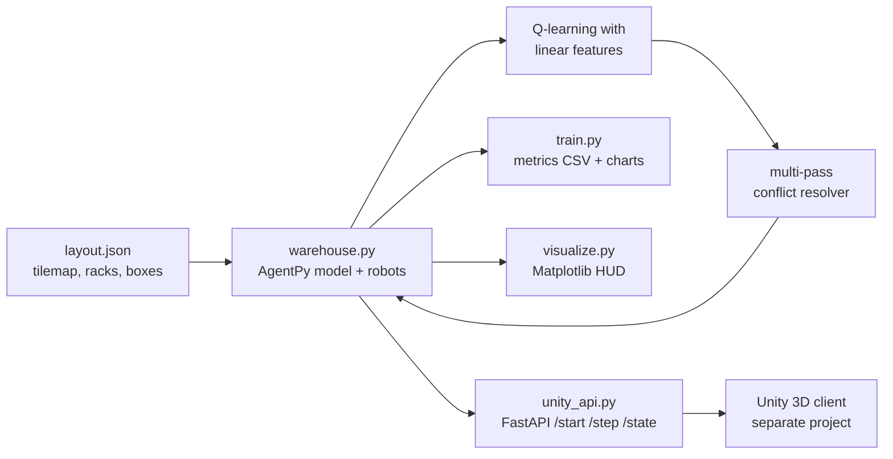
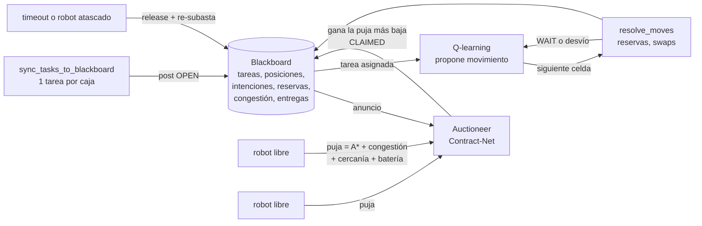

# Warehouse Multi‑Robot RL Simulation

<p>  </p>
**Multi-robot warehouse simulation where a shared Q-learning policy learns to pick up and deliver boxes, with deterministic conflict resolution to keep robots from colliding or deadlocking.**

**Author:** [Hermann Pauwells Rivera](https://hermannpr.github.io/) · Tecnológico de Monterrey, 2024 · **Stack:** Python, AgentPy, NumPy, Matplotlib, FastAPI (Unity client)





A Python project for training and visualizing a warehouse with multiple robots using Q‑learning (linear function approximation). Includes a Matplotlib viewer, CSV‑driven training metrics and charts, and a lightweight FastAPI server for Unity/clients.

## The problem

Each robot has a mission (pick up a box, deliver it, recharge), but several robots share the same corridors. The interesting part isn't a single robot navigating from A to B, it's deciding **who goes where** when they converge on the same shelf or collide head-on. I trained a shared Q‑learning policy over the whole team, then layered deterministic conflict-resolution rules on top so the learned mover stays physically consistent.

## Features
- Multi‑robot environment with missions: PICKUP → DELIVERY, RESTING, RECHARGE.
- Q‑learning with linear features (per‑action φ), γ‑discount, ε‑greedy with fast exponential decay.
- Multi‑pass conflict resolution (many‑to‑one merges, occupant‑stays, head‑on swaps).
- Blackboard coordination layer (`blackboard.py`): shared task board, robot positions/intents, next‑cell reservations, congestion map.
- Contract‑Net task auctions (`auction.py`): robots bid with A* path cost + congestion + crowding + battery; lowest bid wins; re‑auction on timeout or stuck robot.
- Allocation benchmark (`benchmark_allocation.py`) comparing greedy vs auction on seeded episodes, plus pytest suite in `tests/`.
- Matplotlib visualization with HUD, mission rings, carrying indicator, conflict WAIT highlight.
- CSV metrics export and non‑blocking plotting; single image of key charts.
- Unity integration via FastAPI: `/start`, `/step?steps=N`, `/state` returning a compact JSON envelope.
- Weights persistence: current and best models saved incrementally.

## The hard part

Training a fleet of robots to pick up and drop off boxes without deadlocking each other is the interesting bit. I used Q-learning with linear function approximation: each action scores a weighted sum of hand-built features (distance to the box, whether I'm carrying, heading, battery) instead of a giant state table. Then I spent most of the effort on the *conflict* problem: when five robots converge on one drop zone, something has to yield. I built a multi-pass resolver that handles many-to-one merges, occupant-stays and head-on swaps, then added stuck detection and a safe-zone system so a robot that gets boxed in frees itself instead of training forever.

The result is a real, tunable sim you can watch: deliveries converge over 1,000 episodes, the learned policy is served to an external client over FastAPI (`/start`, `/step`, `/state`), and the analysis scripts in this repo show the win-rate and learning curves that actually happened.

## Coordinación: Blackboard + subastas de tareas

Q-learning decide **cómo** se mueve cada robot. Encima hay una capa de coordinación que decide **qué** caja toma cada robot y **quién** entra primero a una celda disputada. Los agentes no se hablan entre sí: todo pasa por un blackboard compartido.



**Cómo funciona**

- `blackboard.py`: guarda las tareas (`OPEN → ANNOUNCED → CLAIMED → PICKED → DONE`), la posición e intención de cada robot, las reservas de celda del siguiente tick, un mapa de congestión que decae con el tiempo y las entregas por robot. No depende de agentpy, así que se prueba aislado.
- `auction.py`: en cada tick con tareas abiertas y robots libres, el subastador anuncia las tareas (la más antigua primero). Cada robot elegible (nivel de rack compatible, batería suficiente) puja con `longitud de ruta A* + 2·congestión en la ruta + 3·robots cerca de la caja + 0.2·batería faltante`. Gana la puja más baja y ese robot sale de la ronda. Si no recoge la caja antes de su plazo (`40 + 3·costo` ticks), si deja de moverse 15 ticks o si pierde la misión, la tarea se libera y se vuelve a subastar excluyendo al robot que falló.
- Conflictos por reservas (`conflict_mode="blackboard"`): el robot que se queda quieto reserva su celda primero, los que se mueven reservan en orden de prioridad (carga, batería), se bloquean los swaps de frente y el perdedor intenta un desvío lateral antes de esperar. Se itera hasta un punto fijo, así que una espera en cadena también se respeta.
- Todo se configura con `ALLOCATION_MODE` / `CONFLICT_MODE` en `config_constants.py` o por modelo: `Warehouse(parameters={"allocation_mode": "auction", "conflict_mode": "blackboard"})`. El valor por defecto sigue siendo el comportamiento original (`greedy` + `legacy`); la API de Unity arranca en `auction` + `blackboard`.

**Benchmark**

```powershell
python .\benchmark_allocation.py --episodes 20 --steps 400
```

Corre los mismos episodios con semilla en cada modo, con los mismos pesos entrenados (`weights/W_linear_best.npy`) y epsilon 0.05, y guarda `docs/benchmark_allocation.csv` (por episodio), `docs/benchmark_allocation.md` (tabla) y `docs/benchmark_allocation.png`.


20 episodios con semilla por modo, 400 ticks, 4 robots, pesos `W_linear_best.npy`, epsilon 0.05.

| Modo | Entregas válidas / episodio | Ticks por entrega | Recogidas fantasma | Misiones duplicadas | Esperas forzadas por conflicto | Colisiones (misma celda) | Eventos de atasco | Tiempo ocioso (%) | Re-subastas | vs baseline |
|---|---:|---:|---:|---:|---:|---:|---:|---:|---:|---:|
| baseline | 18.4 ± 2.5 | 24.4 | 1.7 | 6.4 | 0.3 | 0.3 | 0.0 | 20.2 | 0.0 | - |
| greedy+blackboard | 18.7 ± 2.4 | 23.8 | 1.8 | 6.5 | 0.0 | 0.0 | 0.0 | 20.0 | 0.0 | +1% |
| auction+legacy | 38.0 ± 2.6 | 10.8 | 0.0 | 0.0 | 0.5 | 0.5 | 0.0 | 2.4 | 2.6 | +106% |
| auction | 37.9 ± 2.7 | 10.8 | 0.0 | 0.0 | 0.1 | 0.0 | 0.0 | 2.4 | 2.8 | +105% |

"Entregas válidas" solo cuenta cajas que realmente estaban en la celda al recogerlas. Qué muestran los números:

- La subasta duplica las entregas (+105%) y baja el tiempo ocioso de 20% a 2.4%. La mayor parte de la ganancia viene del estado de tareas del blackboard, no del precio de la puja por sí solo: el asignador original llena su cola con cajas al azar, repite la misma caja para dos robots (misiones duplicadas y recogidas fantasma) y deja robots parados cuando la cola solo tiene cajas de un nivel que no pueden alcanzar. Con el blackboard hay una tarea por caja y solo pujan robots compatibles.
- Las reservas del blackboard no cambian el throughput en este mapa (+1%): con 4 robots en 23×23 los conflictos son raros. Lo que sí hacen es eliminar las colisiones residuales del resolvedor original (robots que terminan en la misma celda).
- Probado con `pytest tests/` (reservas, swaps, esperas en cadena, ganador de subasta, re-subasta por timeout, episodio corto en ambos modos y contrato de la API).

## Project layout
```
warehouse.py          # Environment, RL, training helpers, serializer
blackboard.py         # Shared knowledge store: tasks, intents, reservations, congestion
auction.py            # Contract-Net auctioneer (announce, bid, award, re-auction)
benchmark_allocation.py # Greedy vs auction benchmark -> docs/benchmark_allocation.*
tests/                # pytest suite for blackboard, auction, integration and API
train.py              # CLI for train/test/visualize, metrics export & charts
run.py                # Simple menu runner (Windows-friendly)
unity_api.py          # FastAPI app exposing the model to clients (Unity)
visualize.py          # Matplotlib visualizer (runtime HUD & controls)
layout.json           # Map/config file (tilemap, tags, racks, boxes)
requirements.txt      # Dependencies
metrics_out/          # (Generated) CSVs & charts
weights/              # (Generated) saved weights
```

## Requirements
- Python 3.10+ (tested with 3.11)
- Packages:
  - numpy, agentpy, matplotlib, fastapi, uvicorn

Install:
```powershell
python -m pip install -r .\requirements.txt
```

## Quick start (menu)
Run the menu and follow the prompt:
```powershell
python .\run.py
```
Options:
- 1 Test configuration
- 2 Quick training (100 episodes) + charts
- 3 Full training (1000 episodes) + charts (faster epsilon decay)
- 4 Visualization demo
- 5 Test run (no visualization)

The menu uses the current Python executable and absolute paths (reliable on Windows). Charts and CSVs are written to `metrics_out/`.

## Direct CLI usage
Train and plot (non‑blocking):
```powershell
python .\train.py train --episodes 1000 --export-metrics .\metrics_out --plot
```
Visualize (loads best available weights; keys: SPACE pause, S step, R reset, Q quit):
```powershell
python .\train.py visualize --steps 1000 --fps 8
```
Test run (headless):
```powershell
python .\train.py test --steps 1000 --export-metrics .\metrics_out --plot
```

## Training details
- Algorithm: tabular‑style Q with linear function approximation
  - γ (GAMMA): 0.95
  - α (ALPHA): 0.05 (reduce to 0.02 for more stability if needed)
- Epsilon schedule (fast decay):
  - EPSILON_START=1.0, EPSILON_END=0.05, DECAY_STEPS=10_000, TAU≈DECAY_STEPS/6
  - Effective: quick drop early, long decaying tail
- Rewards (key):
  - Step: −0.01, Shaping: +0.04·(d_prev − d_next)
  - Pickup: +2.0, Delivery: +8.0, Conflict wait: −0.15
  - Recharge: +0.5, Low‑battery (rare): −0.5
- Battery (non‑blocking for training):
  - Drain move 0.10, wait 0.05; recharge +5; low‑battery threshold 5–10%
  - Robots rarely recharge during training so learning focuses on navigation/delivery.
- Weights: saved to `weights/` as `W_linear.npy` and `W_linear_best.npy` (+ checkpoints by episode). Pretrained weights are loaded when available.

## Metrics and charts
When `--export-metrics <dir>` is used, the following files are written:
- `per_step.csv`: step, reward, td_error, success_gt0, delivered
- `per_episode.csv`: episode, total_reward, deliveries
- `summary.json`: totals, final epsilon, aggregates
- `training_results.png`: image with 4 panels:
  - Reward per Step
  - Deliveries per Episode (+ rolling avg)
  - Total Reward per Episode (+ rolling avg)
  - Epsilon & Delivery Win‑Rate (EMA + cumulative + positive‑reward proxy)

Tip: The “Reward>0%” line is a proxy from per‑step positives; a rising “Deliveries per Episode” and cumulative delivery curve are stronger signals of real task completion.

## Visualization
- Matplotlib viewer shows:
  - Mission ring, carrying indicator, target lines, forced‑wait (conflict) ring.
  - HUD with steps, epsilon, cycle deliveries (auto‑cycle for demos).
- Controls: SPACE pause, S step, R reset, Q quit, +/- speed.

## Unity/HTTP API
Start the API:
```powershell
python -m uvicorn unity_api:app --host 127.0.0.1 --port 8000
```
Endpoints:
- `POST /start`: initialize the model (loads config, enables cycle reset, low epsilon for eval)
- `POST /step?steps=N`: advance N ticks; returns state envelope
- `GET /state`: return current envelope without stepping

Envelope (abbrev):
```json
{
  "initialized": true,
  "running": true,
  "state": {
    "ticks": <int>,
    "episode_done": <bool>,
    "robots": [{"id":int,"x":int,"y":int,"heading":int,"action":str,"carrying":bool}],
    "boxes": [{"x":int,"y":int,"level":int,"available":bool}],
    "actions": [{"robot_id":int, "action":str}]
  }
}
```
Notes:
- `heading`: 0=UP, 1=RIGHT, 2=DOWN, 3=LEFT; `action` aligns with Unity motion verbs.
- `actions` list contains per‑tick events collected during the last step.

Coordination fields (additive, existing keys unchanged):
- `POST /start?allocation=auction|greedy&conflict=blackboard|legacy` (defaults: env `WAREHOUSE_ALLOCATION` / `WAREHOUSE_CONFLICT`, else `auction` / `blackboard`).
- Each robot gets `task_id` (claimed task or `null`).
- `state.coordination = {allocation_mode, conflict_mode, blackboard}` where `blackboard` has `tasks` (with `status`, `claimed_by` and `bids` per robot), `reservations`, `intents`, `congestion`, `delivered`, `counters` and recent `events`.
- `GET /blackboard`: full snapshot with the last 50 events.

## Configuration (`layout.json`)
Expected fields (minimum):
- `tilemap.walkable`: 2D array with indices into `tilemap.legend` (walkable mask)
- `tilemap.legend`: mapping of index → truthy/falsey (walkable)
- `tags`: list of tagged cells: `{type: "DROP"|"CHARGE"|"REST"|"SPAWN", pos:[x,y]}`
- `entities.racks`: rack definitions with `id` and `rect` (`x,y,w,h`)
- `boxes`: either `{pos:[x,y,h]}` or `{rack_id:<id>, slot:{bay:<int>, level:<int>}}` (auto‑mapped to pos)

## Troubleshooting
- Missing packages: install via `pip install -r requirements.txt`.
- Plots block UI: plotting is non‑blocking by default; image saved to `<out>/training_results.png`.
- Windows quoting: `run.py` uses `sys.executable` + absolute paths via `subprocess`.
- No deliveries trend: consider lowering `ALPHA` further, increasing `R_DROP`, or training longer; reduce robot count for a curriculum.
- Battery interference: thresholds/drains are already minimized; to re‑enable realism, revert constants in `warehouse.py`.

## Next steps
- Optional CORS for the API if accessed from a browser.
- Curriculum settings, curriculum map variants, and richer feature engineering.
- Per‑robot metrics CSV and more granular diagnostics.

---
If you have questions, check `warehouse.py` for environment, `train.py` for CLI/plots, and `unity_api.py` for server endpoints.

## Screenshots

Resultados del entrenamiento: winrate final y curva de aprendizaje del warehouse.


