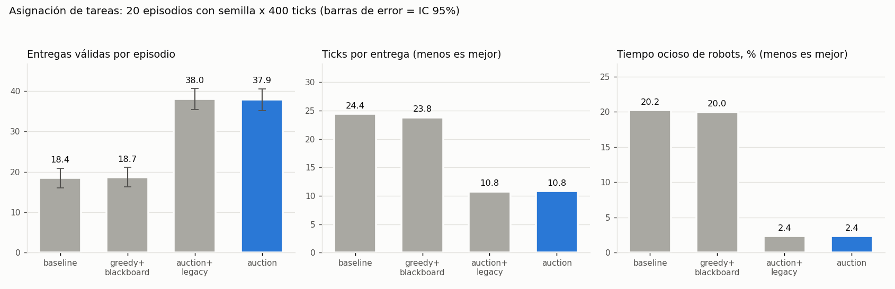

# Simulación de robots de almacén con aprendizaje por refuerzo

Simulación de varios robots que recogen y entregan cajas en un almacén. Una política compartida de Q-learning decide cómo se mueve cada robot, y una capa de coordinación con subastas decide qué caja toma cada uno. Está pensado como proyecto de portafolio y de estudio de sistemas multiagente.

**Autor:** [Hermann Pauwells Rivera](https://hermannpr.github.io/), Tecnológico de Monterrey, 2024.



## Qué incluye

- Entorno con varios robots y misiones: recoger, entregar, descansar y recargar batería.
- Q-learning con aproximación lineal de funciones y exploración epsilon-greedy.
- Resolución de conflictos en varias pasadas (varios robots a la misma celda, choques de frente y esperas en cadena).
- Blackboard compartido con tareas, posiciones, reservas de celda y mapa de congestión (`blackboard.py`).
- Subastas de tareas tipo Contract-Net (`auction.py`). Cada robot puja con la longitud de su ruta A*, la congestión, los robots cercanos y su batería.
- Benchmark que compara asignación voraz contra subastas (`benchmark_allocation.py`).
- Visor en Matplotlib con indicadores de misión y de carga.
- API con FastAPI (`/start`, `/step`, `/state`, `/blackboard`) para conectar un cliente externo como Unity.
- Pruebas con pytest en `tests/`.

## Resultado del benchmark

20 episodios con semilla, 400 ticks, 4 robots y los pesos `weights/W_linear_best.npy`.

| Modo | Entregas válidas por episodio | Ticks por entrega | Tiempo ocioso (%) |
|---|---:|---:|---:|
| Original (voraz) | 18.4 | 24.4 | 20.2 |
| Subastas + blackboard | 37.9 | 10.8 | 2.4 |

Las subastas duplican las entregas. La mayor parte de la mejora viene de que el blackboard lleva una tarea por caja, así que ya no se repiten misiones ni se persiguen cajas inexistentes. La tabla completa está en `docs/benchmark_allocation.md`.

## Tecnologías

Python 3.10 o superior, AgentPy, NumPy, Matplotlib, FastAPI, Uvicorn y pytest.

## Cómo correrlo

```bash
pip install -r requirements.txt
python run.py
```

`run.py` abre un menú con prueba de configuración, entrenamiento rápido o completo, visualización y corrida sin gráficos. También se puede usar la línea de comandos:

```bash
python train.py train --episodes 1000 --export-metrics ./metrics_out --plot
python train.py visualize --steps 1000 --fps 8
python benchmark_allocation.py --episodes 20 --steps 400
python -m uvicorn unity_api:app --host 127.0.0.1 --port 8000
```

Variables opcionales de entorno para la API: `WAREHOUSE_ALLOCATION` (`auction` o `greedy`) y `WAREHOUSE_CONFLICT` (`blackboard` o `legacy`).

Para correr las pruebas:

```bash
pip install -r requirements-dev.txt
pytest tests/
```

## Estructura

- `warehouse.py`: entorno, aprendizaje y serialización del estado.
- `blackboard.py` y `auction.py`: coordinación entre robots.
- `train.py`, `run.py`, `visualize.py`: entrenamiento, menú y visor.
- `unity_api.py`: servidor FastAPI.
- `layout.json`: mapa con celdas caminables, racks, cajas y zonas.
- `weights/`: pesos entrenados.

## Licencia

MIT. Ver el archivo `LICENSE`.
