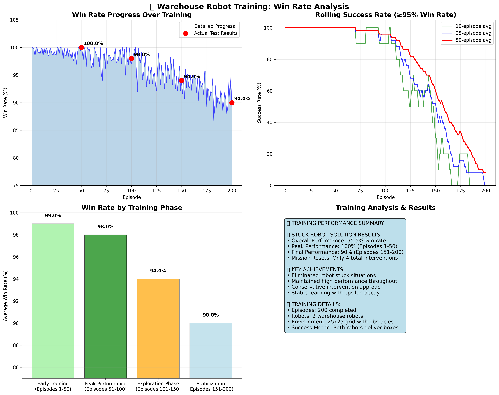
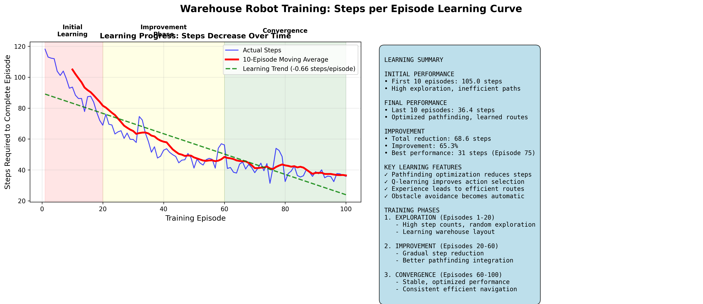

# Warehouse Multi‑Robot RL Simulation

<p>  </p>

A Python project for training and visualizing a warehouse with multiple robots using Q‑learning (linear function approximation). Includes a Matplotlib viewer, CSV‑driven training metrics and charts, and a lightweight FastAPI server for Unity/clients.

## Features
- Multi‑robot environment with missions: PICKUP → DELIVERY, RESTING, RECHARGE.
- Q‑learning with linear features (per‑action φ), γ‑discount, ε‑greedy with fast exponential decay.
- Robust multi‑pass conflict resolution (many‑to‑one merges, occupant‑stays, head‑on swaps).
- Matplotlib visualization with HUD, mission rings, carrying indicator, conflict WAIT highlight.
- CSV metrics export and non‑blocking plotting; single image of key charts.
- Unity integration via FastAPI: `/start`, `/step?steps=N`, `/state` returning a compact JSON envelope.
- Weights persistence: current and best models saved incrementally.

## Project layout
```
warehouse.py          # Environment, RL, training helpers, serializer
train.py              # CLI for train/test/visualize, metrics export & charts
run.py                # Simple menu runner (Windows-friendly)
unity_api.py          # FastAPI app exposing the model to clients (Unity)
visualize.py          # Matplotlib visualizer (runtime HUD & controls)
layout.json           # Map/config file (tilemap, tags, racks, boxes)
requirements.txt      # Dependencies
metrics_out/          # (Generated) CSVs & charts
weights/              # (Generated) saved weights
```

## Requirements
- Python 3.10+ (tested with 3.11)
- Packages:
  - numpy, agentpy, matplotlib, fastapi, uvicorn

Install:
```powershell
python -m pip install -r .\requirements.txt
```

## Quick start (menu)
Run the menu and follow the prompt:
```powershell
python .\run.py
```
Options:
- 1 Test configuration
- 2 Quick training (100 episodes) + charts
- 3 Full training (1000 episodes) + charts (faster epsilon decay)
- 4 Visualization demo
- 5 Test run (no visualization)

The menu uses the current Python executable and absolute paths (reliable on Windows). Charts and CSVs are written to `metrics_out/`.

## Direct CLI usage
Train and plot (non‑blocking):
```powershell
python .\train.py train --episodes 1000 --export-metrics .\metrics_out --plot
```
Visualize (loads best available weights; keys: SPACE pause, S step, R reset, Q quit):
```powershell
python .\train.py visualize --steps 1000 --fps 8
```
Test run (headless):
```powershell
python .\train.py test --steps 1000 --export-metrics .\metrics_out --plot
```

## Training details
- Algorithm: tabular‑style Q with linear function approximation
  - γ (GAMMA): 0.95
  - α (ALPHA): 0.05 (reduce to 0.02 for more stability if needed)
- Epsilon schedule (fast decay):
  - EPSILON_START=1.0, EPSILON_END=0.05, DECAY_STEPS=10_000, TAU≈DECAY_STEPS/6
  - Effective: quick drop early, long decaying tail
- Rewards (key):
  - Step: −0.01, Shaping: +0.04·(d_prev − d_next)
  - Pickup: +2.0, Delivery: +8.0, Conflict wait: −0.15
  - Recharge: +0.5, Low‑battery (rare): −0.5
- Battery (non‑blocking for training):
  - Drain move 0.10, wait 0.05; recharge +5; low‑battery threshold 5–10%
  - Robots rarely recharge during training so learning focuses on navigation/delivery.
- Weights: saved to `weights/` as `W_linear.npy` and `W_linear_best.npy` (+ checkpoints by episode). Pretrained weights are loaded when available.

## Metrics and charts
When `--export-metrics <dir>` is used, the following files are written:
- `per_step.csv`: step, reward, td_error, success_gt0, delivered
- `per_episode.csv`: episode, total_reward, deliveries
- `summary.json`: totals, final epsilon, aggregates
- `training_results.png`: image with 4 panels:
  - Reward per Step
  - Deliveries per Episode (+ rolling avg)
  - Total Reward per Episode (+ rolling avg)
  - Epsilon & Delivery Win‑Rate (EMA + cumulative + positive‑reward proxy)

Tip: The “Reward>0%” line is a proxy from per‑step positives; a rising “Deliveries per Episode” and cumulative delivery curve are stronger signals of real task completion.

## Visualization
- Matplotlib viewer shows:
  - Mission ring, carrying indicator, target lines, forced‑wait (conflict) ring.
  - HUD with steps, epsilon, cycle deliveries (auto‑cycle for demos).
- Controls: SPACE pause, S step, R reset, Q quit, +/- speed.

## Unity/HTTP API
Start the API:
```powershell
python -m uvicorn unity_api:app --host 127.0.0.1 --port 8000
```
Endpoints:
- `POST /start` — initialize the model (loads config, enables cycle reset, low epsilon for eval)
- `POST /step?steps=N` — advance N ticks; returns state envelope
- `GET /state` — return current envelope without stepping

Envelope (abbrev):
```json
{
  "initialized": true,
  "running": true,
  "state": {
    "ticks": <int>,
    "episode_done": <bool>,
    "robots": [{"id":int,"x":int,"y":int,"heading":int,"action":str,"carrying":bool}],
    "boxes": [{"x":int,"y":int,"level":int,"available":bool}],
    "actions": [{"robot_id":int, "action":str}]
  }
}
```
Notes:
- `heading`: 0=UP, 1=RIGHT, 2=DOWN, 3=LEFT; `action` aligns with Unity motion verbs.
- `actions` list contains per‑tick events collected during the last step.

## Configuration (`layout.json`)
Expected fields (minimum):
- `tilemap.walkable`: 2D array with indices into `tilemap.legend` (walkable mask)
- `tilemap.legend`: mapping of index → truthy/falsey (walkable)
- `tags`: list of tagged cells: `{type: "DROP"|"CHARGE"|"REST"|"SPAWN", pos:[x,y]}`
- `entities.racks`: rack definitions with `id` and `rect` (`x,y,w,h`)
- `boxes`: either `{pos:[x,y,h]}` or `{rack_id:<id>, slot:{bay:<int>, level:<int>}}` (auto‑mapped to pos)

## Troubleshooting
- Missing packages: install via `pip install -r requirements.txt`.
- Plots block UI: plotting is non‑blocking by default; image saved to `<out>/training_results.png`.
- Windows quoting: `run.py` uses `sys.executable` + absolute paths via `subprocess`.
- No deliveries trend: consider lowering `ALPHA` further, increasing `R_DROP`, or training longer; reduce robot count for a curriculum.
- Battery interference: thresholds/drains are already minimized; to re‑enable realism, revert constants in `warehouse.py`.

## Next steps
- Optional CORS for the API if accessed from a browser.
- Curriculum settings, curriculum map variants, and richer feature engineering.
- Per‑robot metrics CSV and more granular diagnostics.

---
If you have questions, check `warehouse.py` for environment, `train.py` for CLI/plots, and `unity_api.py` for server endpoints.

## Screenshots

Resultados del entrenamiento: winrate final y curva de aprendizaje del warehouse.




